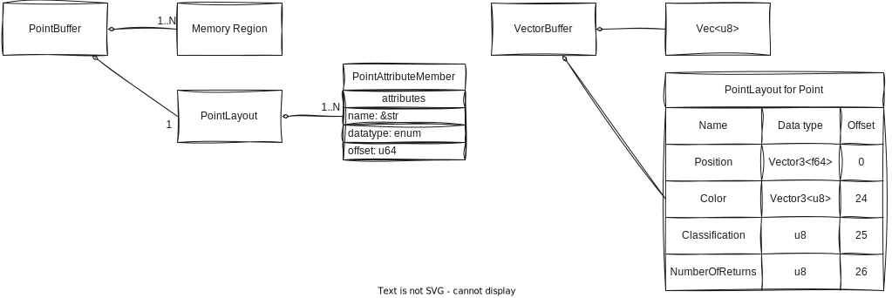
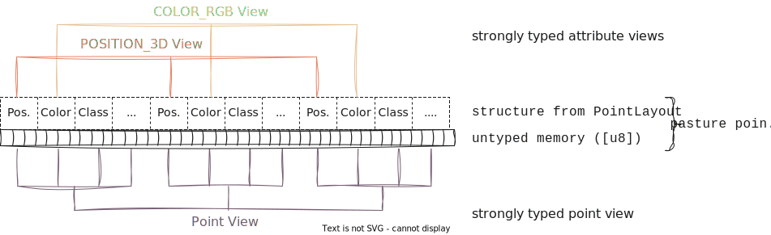

# The data model of `pasture`

In order to effectively work with `pasture`, it helps to understand the underlying data model, and how it relates to the typical structure of LiDAR point clouds. In this section, you will learn:
- [The basics of LiDAR point clouds](#the-basics-of-lidar-point-clouds)
- [How `pasture` represents a point cloud in memory](#how-pasture-represents-a-point-cloud-in-memory)

## The basics of LiDAR point clouds

LiDAR stands for 'Light Detection And Ranging' and is a technology for the acquisition of three-dimensional datasets called *point clouds*. LiDAR is typically used to create 3D scans of the real world, from individual objects like trees or cultural artifacts, up to the elevation profile of whole countries. One of the most hands-on things one can do with such a point cloud is to visualize it interactively. A popular tool for point cloud visualizations is [Potree](https://potree.github.io/), which runs inside most modern browsers. Feel free to explore the examples that Potree provides to get a feel for what a point cloud looks like. The [CA13 example](http://potree.org/potree/examples/ca13.html) is a good start, because it shows the main challenges when working with (LiDAR) point clouds:
- Point clouds are often spatially large, covering dozens or hundreds of kilometers of space
- Point clouds are made up of millions, billions, or sometimes even trillions of individual points
- Point clouds can encode various attributes within a point

Here is a screenshot from the CA13 example, displaying a point cloud with four different attributes (color, number of returns, classification, intensity):


Since `pasture` deals with the memory representation of point clouds, how would we represent a point cloud in memory in a systems programming language such as Rust? 

A point cloud is a collection of individual points, where each point is simply a tuple of attributes. LiDAR point clouds are always spatial, so each point has a *position* attribute, typically a vector in 3-dimensional space. Other attributes might include a monochrome intensity value or an RGB color, sensor-specific values such as the number of return pulses for each laser pulse, or high-level attributes such as the type of object that a point belongs to (typically called the *classification* of a point). So a point cloud data structure in Rust might look like this:

```rust
use nalgebra::Vector3;

type Position = Vector3<f64>;
type Classification = u8;
type Color = Vector3<u8>;
type NumberOfReturnPulses = u8;

type Point = (Position, Color, Classification, NumberOfReturnPulses);

type PointCloud = Vec<Point>;
```

Only a few lines of code and we have a working point cloud data type. So why do we need `pasture` at all? Turns out, point clouds are more complex than they might look like at a first glance. In particular, `pasture` solves several problems that our current data structure has:
- Problem 1: Different point clouds have different attributes, but there are a fairly large number of common attributes that we do not want to rewrite every time
- Problem 2: Point cloud data is typically stored in files with specific binary layouts, such as LAS. We don't want to read/write these files manually
- Problem 3: We might want specific control over the memory layout of a single point, including the size of fields and their alignment
- Problem 4: We might want specific control over the memory layout of *all* points. `Vec` has a so-called *interleaved* memory layout, meaning the attributes of each point are interleaved (stored together in memory). What if we don't want that and instead want to store the same attribute for multiple points together in memory (as so-called *columnar* memory layout)?
- Problem 5: A point cloud might have more metadata associated with it, for example an [axis-aligned bounding box](https://en.wikipedia.org/wiki/Minimum_bounding_box)

## How `pasture` represents a point cloud in memory

`pasture` provides a very flexible memory model for the in-memory representation of a point cloud. This model is somewhat complex in order to allow fine-grained control over the memory layout as well as the memory ownership model, but don't worry as there are some sensible defaults!

The core data structure in `pasture` is called a **point buffer**. A point buffer is a combination of one or more memory regions together with a metadata object called a **point layout**, which describes which attributes each point has and how exactly they are represented in memory. This is essentially a runtime equivalent of the [representation of a user-defined composite type in Rust](https://doc.rust-lang.org/reference/type-layout.html#representations). It stores the data type, size, offset, and alignment of all attributes within a single point, just as the Rust compiler generates for a custom `struct` to determine which members are located at which offsets. The following diagram illustrates this concept using an abstract point buffer (left) and the specific `VectorBuffer` type together with the `Point` type from the previous example (right):



When working with point clouds in `pasture`, you have two options for accessing the data: Accessing individual attributes through an attribute specifier (called a [`PointAttributeDefinition`](https://docs.rs/pasture-core/latest/pasture_core/layout/struct.PointAttributeDefinition.html)), or accessing individual points as user-defined `struct`s. Since the underlying memory that a point buffer references is untyped, but Rust is a statically typed language, there has to be a point where we move from untyped to typed data. `pasture` does this through data accessor objects called *views*. The basic point buffer API only deals with untyped memory (typically through byte slices `[u8]`) but views provide strongly typed access to point attributes and points as a whole:



`pasture` has many built-in definitions for commonly used point attributes, which are listed in the [`layout::attributes` module](https://docs.rs/pasture-core/latest/pasture_core/layout/attributes/index.html). Putting everything together, we can now understand the example code from the [Overview](overview.md) section:

```rust,editable
use anyhow::{bail, Context, Result};
use pasture_core::{
    containers::{BorrowedBuffer, VectorBuffer},
    layout::attributes::POSITION_3D,
    nalgebra::Vector3,
};
use pasture_io::base::{read_all};

fn main() -> Result<()> {
    let points = read_all::<VectorBuffer, _>("pointcloud.las").context("Failed to read points")?;

    if points.point_layout().has_attribute(&POSITION_3D) {
        for position in points
            .view_attribute::<Vector3<f64>>(&POSITION_3D)
            .into_iter()
            .take(10)
        {
            println!("({};{};{})", position.x, position.y, position.z);
        }
    } else {
        bail!("Point cloud files has no positions!");
    }

    Ok(())
}
```

In line 10 we read a point cloud from a file and store it as a `VectorBuffer`, a builtin point buffer type that `pasture` provides. As the name suggest, it stores points using a `Vec`, specifically a `Vec<u8>` since point buffer memory is always untyped in `pasture`. This is necessary because the exact format of a point record is not known until *runtime* as it depends on the format of the LAS file we read. The buffer gives access to its `PointLayout`, which we can ask about the attributes that the point cloud contains (line 12). The `POSITION_3D` value is one of the predefined attribute definitions and represents the 3D position attribute, as the name implies. If such an attribute is present in the point cloud, we can obtain a strongly typed view of the 3D positions (line 14), using the `view_attribute::<T>` function, where `T` is the data type that we want to access the attributes in. Views are convertible into iterators, so we can use the attribute view to iterate over all positions of the point cloud (or the first 10, in this example). Under the hood, `pasture` handles all the data reading from the untyped memory within the `VectorBuffer`. 

## "I'm not convinced, why all the work?"

Depending on your personal background and preferences, you might be sceptical about this approach to point cloud data management. Why do we need the `PointLayout` type, why the views and why do we have to manually specify the type of the positions once we obtain a view to them? Can't `pasture` do this automatically? 

It helps to look at another Rust library for point cloud processing (that is also used in `pasture` for dealing with LAS and LAZ files): The [`las`](https://docs.rs/las/latest/las/) crate. It has the following example code in its documentation:

```rust,editable
use las::{Read, Reader};
let mut reader = Reader::from_path("tests/data/autzen.las").unwrap();
for wrapped_point in reader.points() {
    let point = wrapped_point.unwrap();
    println!("Point coordinates: ({}, {}, {})", point.x, point.y, point.z);
    if let Some(color) = point.color {
        println!("Point color: red={}, green={}, blue={}",
            color.red,
            color.green,
            color.blue,
        );
    }
}
```

`las` has a custom `Reader` type through which we can iterate over all points in a LAS file (lines 2 and 3). The points themselves have a specific type called [`Point`](https://docs.rs/las/latest/las/point/struct.Point.html) which provides direct accessors to the position attribute using `point.x`, `point.y` and `point.z` (the type itself is ommited in the example code due to the type deduction rules of the Rust compiler). This type is the same, no matter what type of LAS file we load, so the `las` crate has to do some conversion internally from the point records within the LAS file to this `Point` type. This approach prioritizes convenience at the expense of performance. The conversion process itself has some overhead, and the `Point` type has a lot of memory overhead, since it has to include every possible LAS attribute (currently there are about 20 as per the [LAS specification version 1.4](https://www.asprs.org/wp-content/uploads/2019/07/LAS_1_4_r15.pdf)). The least amount of memory that a point in a LAS file requires is 20 bytes, but the `Point` structure from the `las` crate always requires 136 bytes (64-bit, version 0.8.1). That's an overhead of almost 7 times! Putting this into perspective, on a machine with 16GB of RAM, we could keep about 117 million `las` points in RAM, but 800 million raw LAS points. 

With `pasture`, we can specify the exact memory layout of the point records, so we could get a `PointLayout` that exactly matches the binary layout of a point record in the LAS file. Besides the improvement in memory efficiency, this also makes parsing a lot simpler, in the best case parsing is a no-op (check out the [fast LAS parsing example](https://github.com/Mortano/pasture/blob/main/pasture-io/examples/fast_las_parsing.rs) of `pasture`). But it doesn't end there. With `pasture`, since we have precise control over the memory layout of a point buffer, we can also omit attributes. Oftentimes, we are not interested in all the attributes within a point cloud. In cases like these, `pasture` allows creating a reduced `PointLayout` that for example only contains the `POSITION_3D` attribute. Reading a point cloud using this layout will only parse the 3D positions and ignore all other data, further increasing the memory efficiency.

Lastly, the approach of the `las` crate always assumes an interleaved memory layout. It is impossible to read data into a columnar memory layout this way. The control that `pasture` provides makes this possible and is often as simple as replacing the `VectorBuffer` type with the default columnar buffer type: `HashMapBuffer`.