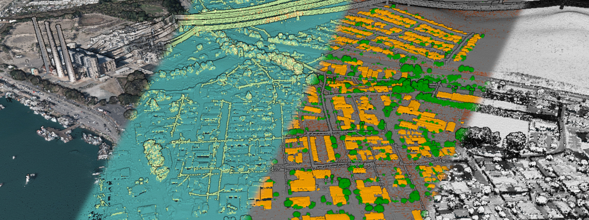

# The data model of `pasture`

In order to effectively work with `pasture`, it helps to understand the underlying data model, and how it relates to the typical structure of LiDAR point clouds. In this section, you will learn:
- [The basics of LiDAR point clouds](#the-basics-of-lidar-point-clouds)
- [How `pasture` represents a point cloud in memory](#how-pasture-represents-a-point-cloud-in-memory)

## The basics of LiDAR point clouds

LiDAR stands for 'Light Detection And Ranging' and is a technology for the acquisition of three-dimensional datasets called *point clouds*. LiDAR is typically used to create 3D scans of the real world, from individual objects like trees or cultural artifacts, up to the elevation profile of whole countries. One of the most hands-on things one can do with such a point cloud is to visualize it interactively. A popular tool for point cloud visualizations is [Potree](https://potree.github.io/), which runs inside most modern browsers. Feel free to explore the examples that Potree provides to get a feel for what a point cloud looks like. The [CA13 example](http://potree.org/potree/examples/ca13.html) is a good start, because it shows the main challenges when working with (LiDAR) point clouds:
- Point clouds are often spatially large, covering dozens or hundreds of kilometers of space
- Point clouds are made up of millions, billions, or sometimes even trillions of individual points
- Point clouds can encode various attributes within a point

Here is a screenshot from the CA13 example, displaying a point cloud with four different attributes (color, number of returns, classification, intensity):



Since `pasture` deals with the memory representation of point clouds, how would we represent a point cloud in memory in a systems programming language such as Rust? 

A point cloud is a collection of individual points, where each point is simply a tuple of attributes. LiDAR point clouds are always spatial, so each point has a *position* attribute, typically a vector in 3-dimensional space. Other attributes might include a monochrome intensity value or an RGB color, sensor-specific values such as the number of return pulses for each laser pulse, or high-level attributes such as the type of object that a point belongs to (typically called the *classification* of a point). So a point cloud data structure in Rust might look like this:

```rust
use nalgebra::Vector3;

type Position = Vector3<f64>;
type Classification = u8;
type Color = Vector3<u8>;
type NumberOfReturnPulses = u8;

type Point = (Position, Color, Classification, NumberOfReturnPulses);

type PointCloud = Vec<Point>;
```

Only a few lines of code and we have a working point cloud data type. So why do we need `pasture` at all? Turns out, point clouds are more complex than they might look like at a first glance. In particular, `pasture` solves several problems that our current data structure has:
- Problem 1: Different point clouds have different attributes, but there are a fairly large number of common attributes that we do not want to rewrite every time
- Problem 2: Point cloud data is typically stored in files with specific binary layouts, such as LAS. We don't want to read/write these files manually
- Problem 3: We might want specific control over the memory layout of a single point, including the size of fields and their alignment
- Problem 4: We might want specific control over the memory layout of *all* points. `Vec` has a so-called *interleaved* memory layout, meaning the attributes of each point are interleaved (stored together in memory). What if we don't want that and instead want to store the same attribute for multiple points together in memory (as so-called *columnar* memory layout)?
- Problem 5: A point cloud might have more metadata associated with it, for example an [axis-aligned bounding box](https://en.wikipedia.org/wiki/Minimum_bounding_box)

## How `pasture` represents a point cloud in memory

`pasture` provides a very flexible memory model for the in-memory representation of a point cloud. This model is somewhat complex in order to allow fine-grained control over the memory layout as well as the memory ownership model, but don't worry as there are some sensible defaults!

The core data structure in `pasture` is called a **point buffer**. A point buffer is a combination of one or more memory regions together with a metadata object called a **point layout**, which describes which attributes each point has and how exactly they are represented in memory. This is essentially a runtime equivalent of the [representation of a user-defined composite type in Rust](https://doc.rust-lang.org/reference/type-layout.html#representations). It stores the data type, size, offset, and alignment of all attributes within a single point, just as the Rust compiler generates for a custom `struct` to determine which members are located at which offsets. 


When working with point clouds in `pasture`, you have two options for accessing the data: Accessing individual attributes through an attribute specifier (called a [`PointAttributeDefinition`](https://docs.rs/pasture-core/latest/pasture_core/layout/struct.PointAttributeDefinition.html)), or accessing individual points as user-defined `struct`s. 