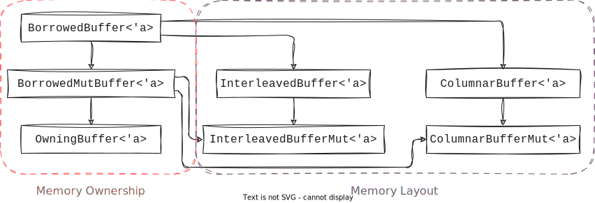

# The buffer traits that `pasture` exposes

While `pasture` has only three primary built-in buffer types at the moment, it exposes a hierarchy of buffer traits that define the memory layout and ownership model that `pasture` is built around. In this section you will learn about all the different buffer traits and gain a deeper understanding of how `pasture` treats point cloud memory.

## Memory layout vs. ownership

At its core, `pasture` distinguishes between two properties of a point buffer: Its **memory layout** and its **memory ownership model**. Each of these two properties comes in several 'flavors' which can (for the most part) be freely combined, resulting in a large number of potential buffer types. The following image shows the full buffer trait hierarchy in `pasture`:



For the memory ownership, `pasture` distinguishes between three types of ownership:
- A buffer immutably borrows its memory. This is the weakest guarantee and represented by the base trait [`BorrowedBuffer<'a>`](https://docs.rs/pasture-core/0.4.0/pasture_core/containers/trait.BorrowedBuffer.html)
- A buffer mutably borrows its memory. This is the next stronger guarantee and represented by the [`BorrowedMutBuffer<'a>`](https://docs.rs/pasture-core/0.4.0/pasture_core/containers/trait.BorrowedMutBuffer.html) trait
- A buffer owns its memory. This is the strongest guarantee and represented by the [`OwningBuffer<'a>`](https://docs.rs/pasture-core/0.4.0/pasture_core/containers/trait.OwningBuffer.html) trait

Each stronger ownership guarantee implies all weaker guarantees, which is why `OwningBuffer<'a>` is a supertrait of `BorrowedMutBuffer<'a>`, which in turn is a supertrait of `BorrowedBuffer<'a>`. This also explains why `OwningBuffer<'a>` has a lifetime bound: `BorrowedBuffer<'a>` requires a lifetime bound to tell the borrow checker for which lifetime `'a` the memory is borrowed, and this propagates to all supertraits. 

For the memory layout, there are three options:
- An unspecified memory layout, which only allows accessing points and attributes by value (through copy operations). This is the memory layout guarantee that [`BorrowedBuffer<'a>`](https://docs.rs/pasture-core/0.4.0/pasture_core/containers/trait.BorrowedBuffer.html) has
- An *interleaved* memory layout, which allows accessing point data by reference/borrow. Mutable access requires a mutable ownership model, which is why [`InterleavedBuffer<'a>`](https://docs.rs/pasture-core/0.4.0/pasture_core/containers/trait.InterleavedBuffer.html) is only a supertrait of `BorrowedBuffer<'a>` and provides only immutable point access, whereas [`InterleavedBufferMut<'a>`](https://docs.rs/pasture-core/0.4.0/pasture_core/containers/trait.InterleavedBufferMut.html) is a supertrait of `BorrowedMutBuffer<'a>` and allows mutably borrowing points.
- A *columnar* memory layout, which allows accessing attribute data by reference/borrow. Analogous to the interleaved layout traits, [`ColumnarBuffer<'a>`](https://docs.rs/pasture-core/0.4.0/pasture_core/containers/trait.ColumnarBuffer.html) only allows immutable borrows and thus is a supertrait of `BorrowedBuffer<'a>`, whereas [`ColumnarBufferMut<'a>`](https://docs.rs/pasture-core/0.4.0/pasture_core/containers/trait.ColumnarBufferMut.html) is a supertrait of `BorrowedMutBuffer<'a>` and allows mutably borrowing attribute values.

Here are some examples of existing buffer types and which traits they implement:
- `VectorBuffer` owns its memory (since it uses a `Vec<u8>`) and stores data in interleaved layout, so it implements:
    - `OwningBuffer<'a>` (and thus also `BorrowedMutBuffer<'a>` and `BorrowedBuffer<'a>`)
    - `InterleavedBuffer<'a>` and `InterleavedBufferMut<'a>`
- `HashMapBuffer` owns its memory (using a `HashMap` with `Vec<u8>` values) and stores data in a columnar layout, so it implements:
    - `OwningBuffer<'a>` (and thus also `BorrowedMutBuffer<'a>` and `BorrowedBuffer<'a>`)
    - `ColumnarBuffer<'a>` and `ColumnarBufferMut<'a>`
- `ExternalMemoryBuffer<T>` does *not* own its memory (the whole point of this buffer type!) and stores data in interleaved layout, so it implements:
    - `BorrowedBuffer<'a>`
    - `BorrowedMutBuffer<'a>` only if the memory region type `T` is mutably borrowed
    - `InterleavedBuffer<'a>` and&mdash;if the memory region type `T` is mutably borrowed&mdash;`InterleavedBufferMut<'a>`

## The root trait `BorrowedBuffer<'a>`

All point buffers in `pasture` implement the root trait [`BorrowedBuffer<'a>`](https://docs.rs/pasture-core/0.4.0/pasture_core/containers/trait.BorrowedBuffer.html), so it makes sense to take a closer look at it. Here is the trait definition (without provided methods):

```rust,editable
pub trait BorrowedBuffer<'a> {
    // Required methods
    fn len(&self) -> usize;
    fn point_layout(&self) -> &PointLayout;
    fn get_point(&self, index: usize, data: &mut [u8]);
    fn get_point_range(&self, range: Range<usize>, data: &mut [u8]);
    unsafe fn get_attribute_unchecked(
        &self,
        attribute_member: &PointAttributeMember,
        index: usize,
        data: &mut [u8]
    );
}
```

The first two methods it defines are not strictly related to memory ownership or layout and instead are fundamental properties of all point buffers: Each buffer as a `PointLayout` and stores some number of points. These can be accessed through [`fn point_layout(&self) -> &PointLayout`](https://docs.rs/pasture-core/0.4.0/pasture_core/containers/trait.BorrowedBuffer.html#tymethod.point_layout) and [`fn len(&self) -> usize`](https://docs.rs/pasture-core/0.4.0/pasture_core/containers/trait.BorrowedBuffer.html#tymethod.len) respectively. 

The next three methods are the most fundamental accessor methods for point and attribute data in a point buffer. As a user, you will rarely interact with these methods directly as they work exclusively with untyped memory (in the form of byte slices `[u8]`). Let's first look at accessing point data:

```rust,editable
fn get_point(&self, index: usize, data: &mut [u8]);
fn get_point_range(&self, range: Range<usize>, data: &mut [u8]);
```

These functions copy the data for a single point (`get_point`) or a range of consecutive points (`get_point_range`) into a user-defined byte buffer. Since we are still in untyped land, the signature is `fn get_point(&self, index: usize, data: &mut [u8])` and not `fn get_point<T: PointType>(&self, index: usize) -> T`. 

```admonish hint
The signature `fn get_point<T: PointType>(&self, index: usize) -> T` would make the `BorrowedBuffer<'a>` trait object-unsafe, so we could never create trait objects from it. This would be an unnecessary limitation. Instead, this is what the views do: [`PointView::at`](https://docs.rs/pasture-core/0.4.0/pasture_core/containers/struct.PointView.html#method.at) has exactly this signature, except that the type `T` is part of the `PointView` type. 
```

Working with untyped memory might seem terribly unsafe, but `pasture` hides a lot of the unsafety. The only requirement for calling `get_point` or `get_point_range` is that the memory buffer passed into these functions has to be large enough to store the requested point data. In that regard it is similar to calling [`Read::read`](https://doc.rust-lang.org/std/io/trait.Read.html#tymethod.read), a common function in Rust. 

A more complex function is the accessor for attribute data:

```rust,editable
unsafe fn get_attribute_unchecked(
    &self,
    attribute_member: &PointAttributeMember,
    index: usize,
    data: &mut [u8]
);
```

This is an `unsafe` function because it is an optimized accessor that bypasses checks (hence the `unchecked` suffix, a common pattern in Rust). It is the faster but more unsafe variant of [`get_attribute`](https://docs.rs/pasture-core/0.4.0/pasture_core/containers/trait.BorrowedBuffer.html#method.get_attribute). It copies the data for a specific point attribute of the point at `index` into the user-provided buffer. Accessing this data might require knowledge of the offset of the point attribute within the `PointLayout`, which is why `get_attribute_unchecked` requires a `PointAttributeMember` instead of the more general `PointAttributeDefinition`. 

A neat thing is that both [`get_attribute`](https://docs.rs/pasture-core/0.4.0/pasture_core/containers/trait.BorrowedBuffer.html#method.get_attribute) and [`get_attribute_range`](https://docs.rs/pasture-core/0.4.0/pasture_core/containers/trait.BorrowedBuffer.html#method.get_attribute_range) (for getting attribute values for multiple consecutive points) can be implemented using `get_attribute`, so implementors of `BorrowedBuffer<'a>` only need to provide one method instead of two. 

```admonish hint
Notice that every buffer access method of `BorrowedBuffer<'a>` requires copying the point/attribute data! This is precisely what it means to have an unspecified memory layout: No guarantee can be made that it is possible to access points or attributes through references, so we have to resort to copying! Examples of buffer types that cannot make guarantees about their memory layout would be buffers sorting data in disjoint memory regions (e.g. using a linked list) or buffers generating data on the fly. 
```

Based on these three accessor functions, a bunch of provided functions are implemented:

```rust,editable
fn get_attribute(
    &self,
    attribute: &PointAttributeDefinition,
    index: usize,
    data: &mut [u8]
) { ... }
fn get_attribute_range(
    &self,
    attribute: &PointAttributeDefinition,
    point_range: Range<usize>,
    data: &mut [u8]
) { ... }
fn view<'b, T: PointType>(&'b self) -> PointView<'a, 'b, Self, T>
    where Self: Sized,
            'a: 'b { ... }
fn view_attribute<'b, T: PrimitiveType>(
    &'b self,
    attribute: &PointAttributeDefinition
) -> AttributeView<'a, 'b, Self, T>
    where Self: Sized,
            'a: 'b { ... }
fn view_attribute_with_conversion<'b, T: PrimitiveType>(
    &'b self,
    attribute: &PointAttributeDefinition
) -> Result<AttributeViewConverting<'a, 'b, Self, T>>
    where Self: Sized,
            'a: 'b { ... }
```

We already saw `get_attribute` and `get_attribute_range`, and in previous examples also `view` and `view_attribute`. The latter return the `PointView` and `AttributeView` types, which internally use the raw data accessor functions to convert untyped memory into typed values. There is one special view type that we haven't talked about: [`AttributeViewConverting`](https://docs.rs/pasture-core/0.4.0/pasture_core/containers/struct.AttributeViewConverting.html).

## Converting attributes

The `view_attribute` function is very strict: It requires that the `PointAttributeDefinition` passed in *exactly matches* the definition in the `PointLayout` of the buffer. This means that both the name *and* the datatype must match! `pasture` checks this at runtime and panics if this invariant is not met! Here is an example why this can be problematic:

```rust,editable
#[derive(PointType, Clone, Copy, bytemuck::NoUninit, bytemuck::AnyBitPattern)]
#[repr(C, packed)]
struct CustomPointType {
    #[pasture(BUILTIN_INTENSITY)]
    pub intensity: u16,
    #[pasture(BUILTIN_POSITION_3D)]
    pub position: Vector3<f32>,
    #[pasture(attribute = "CUSTOM_ATTRIBUTE")]
    pub custom_attribute: f32,
}
```

The `CustomPointType` type (from the [point layout section](../point_layout.md)) stores a `POSITION_3D` attribute, but with a different datatype than the default one (`Vector3<f32>` instead of `Vector3<f64>`). Calling `view_attribute::<Vector3<f64>>(&POSITION_3D)` on a buffer with the `CustomPointType` layout will panic! Calling `view_attribute::<Vector3<f32>>(&POSITION_3D)` (`f32` instead of `f64`) will panic as well! 

```admonish warning
This may seem annoying, but is due to safety reasons! The resulting view type performs raw memory transmutations, which are amongst the most unsafe things that you can do in Rust. So `pasture` has to make absolutely sure that these transmutations are valid, which they only are if we view the untyped memory in the exact types specified in the buffer's `PointLayout`! 
```

There is a way to deal with this problem: We could convert from `Vector3<f64>` to `Vector3<f32>`, accepting a loss of precision. In fact, there are a bunch of possible conversions, essentially everything that the [`as` operator](https://doc.rust-lang.org/std/keyword.as.html) allows, which we can lift to the `nalgebra` vector types. If we want such a conversion, `pasture` still has to do an initial memory transmutation to the actual type of the attribute, but then it can apply an `as` transformation. This is precisely what [`view_attribute_with_conversion`](https://docs.rs/pasture-core/0.4.0/pasture_core/containers/trait.BorrowedBuffer.html#method.view_attribute_with_conversion) does: It returns a view over attribute values in the strong type `T: PrimitiveType`, even if `T` is different from the datatype of the attribute within the buffer. Not all conversions are valid, for example vector-to-scalar conversions, which is why this function returns a `Result`. Since the resulting attribute view performs conversions, it only ever supports accessing attribute data by value.

## Mutable access to buffer data using `BorrowedMutBuffer<'a>`

Let's look at the `BorrowedMutBuffer<'a>` type and the additional methods it provides. First, here are the required methods:

```rust,editable
pub trait BorrowedMutBuffer<'a>: BorrowedBuffer<'a> {
    // Required methods
    unsafe fn set_point(&mut self, index: usize, point_data: &[u8]);
    unsafe fn set_point_range(
        &mut self,
        point_range: Range<usize>,
        point_data: &[u8]
    );
    unsafe fn set_attribute(
        &mut self,
        attribute: &PointAttributeDefinition,
        index: usize,
        attribute_data: &[u8]
    );
    unsafe fn set_attribute_range(
        &mut self,
        attribute: &PointAttributeDefinition,
        point_range: Range<usize>,
        attribute_data: &[u8]
    );
    fn swap(&mut self, from_index: usize, to_index: usize);
}
```

Where previously we had a bunch of get-accessors, here we see set-methods for points and attributes as well as ranges thereof. There is also [`swap`](https://docs.rs/pasture-core/0.4.0/pasture_core/containers/trait.BorrowedMutBuffer.html#tymethod.swap) for swapping the point data at to indices (very helpful for implementing sorting).

```admonish tip title='Accessing ranges of points'
The `get` and `set` functions on the basic buffer traits come in two flavors: Accessing individual pieces of data (e.g. `set_point`, `set_attribute`) and accessing ranges of data (e.g. `set_point_range`, `set_attribute_range`). If you have to access consecutive points or attributes, prefer to use the range accessors instead of multiple calls to the individual accessors!
```

Notice that all four set-methods are `unsafe`! They have to be, because `pasture` has no way of checking whether the data passed into these functions actually corresponds to the memory layout of the buffer! For this reason, you have to be *very* careful when calling these functions directly. Again, a lot of the unsafety is hidden by using point and attribute views. 

Similar to `BorrowedBuffer<'a>`, a bunch of helper functions are provided:

```rust
fn transform_attribute<'b, T: PrimitiveType, F: Fn(usize, T) -> T>(
    &'b mut self,
    attribute: &PointAttributeDefinition,
    func: F
)
    where Self: Sized,
            'a: 'b { ... }
fn view_mut<'b, T: PointType>(&'b mut self) -> PointViewMut<'a, 'b, Self, T>
    where Self: Sized,
            'a: 'b { ... }
fn view_attribute_mut<'b, T: PrimitiveType>(
    &'b mut self,
    attribute: &PointAttributeDefinition
) -> AttributeViewMut<'a, 'b, Self, T>
    where Self: Sized,
            'a: 'b { ... }
```

We have mutable view accessors ([`view_mut`](https://docs.rs/pasture-core/0.4.0/pasture_core/containers/trait.BorrowedMutBuffer.html#method.view_mut) and [`view_attribute_mut`](https://docs.rs/pasture-core/0.4.0/pasture_core/containers/trait.BorrowedMutBuffer.html#method.view_attribute_mut)) as well as one special function [`transform_attribute`](https://docs.rs/pasture-core/0.4.0/pasture_core/containers/trait.BorrowedMutBuffer.html#method.transform_attribute). This special function allows in-place manipulation of all values of a specific attribute. It is a more efficient version of the following code:

```rust
let mut buffer = ...;
let mut view = buffer.view_attribute_mut::<u16>(&INTENSITY);
for index in 0..buffer.len() {
    let mut intensity = view.at(index);
    intensity *= 2; // Apply some transformation to the intensity value
    view.set_at(index, intensity);
}
```

This `at`/`set_at` pattern is necessary because `BorrowedMutBuffer<'a>` does not know anything about the memory layout of its implementor, so it only provides data access by value. To mutate a value, we have to copy it out of the buffer (using `at`) and then write the mutated value back into the buffer (using `set_at`). The same can be achieved using `transform_attribute`:

```rust
let mut buffer = ...;
buffer.transform_attribute(&INTENSITY, |_index: usize, intensity: u16| -> u16 {
    intensity * 2
});
```

## Resizing buffers using the `OwningBuffer<'a>` trait

The last memory ownership trait is [`OwningBuffer<'a>`](https://docs.rs/pasture-core/0.4.0/pasture_core/containers/trait.OwningBuffer.html). A buffer that implements this trait is the owner of its memory, which means that we can resize this buffer. Let's look at the required methods:

```rust
pub trait OwningBuffer<'a>: BorrowedMutBuffer<'a> + Sized {
    // Required methods
    unsafe fn push_points(&mut self, point_bytes: &[u8]);
    fn resize(&mut self, count: usize);
    fn clear(&mut self);
    fn append_interleaved<'b, B: InterleavedBuffer<'b>>(&mut self, other: &B);
    fn append_columnar<'b, B: ColumnarBuffer<'b>>(&mut self, other: &B);
}
```

It provides three general resizing functions that are similar to those that `Vec` provides: [`push_points`](https://docs.rs/pasture-core/0.4.0/pasture_core/containers/trait.OwningBuffer.html#tymethod.push_points), [`resize`](https://docs.rs/pasture-core/0.4.0/pasture_core/containers/trait.OwningBuffer.html#tymethod.resize), and [`clear`](https://docs.rs/pasture-core/0.4.0/pasture_core/containers/trait.OwningBuffer.html#tymethod.clear). 

`push_points` is the resizing variant of `set_point_range` from the `BorrowedMutBuffer<'a>` trait: It appends the provided points to the end of the buffer. It is `unsafe` because it can't check whether the memory passed to it conforms to the `PointLayout` of the buffer. 

`resize` and `clear` follow the same logic as their identically-named counterparts in `Vec`: `resize` resizes the buffer so that it contains the given number of points, default-constructing new points as needed. This works since all point types in pasture are zero-initializable. `clear` clears the contents of the buffer so that its new length is 0. 

There are two `append_...` functions, which take a buffer in a specified memory layout (interleaved or columnar) and appends the points from this buffer to the current buffer. The distinction regarding the memory layout can enable faster copy operations, as appending to a buffer with the same memory layout will be more efficient as appending to a buffer with a different memory layout. There is also a provided function [`append`](https://docs.rs/pasture-core/0.4.0/pasture_core/containers/trait.OwningBuffer.html#method.append), which does not make assumptions regarding the memory layout of the buffer that shall be appended. It is easier to use but generally will have worse performance.

## The memory layout traits

The memory ownership traits made no assumptions about the memory layout of a point buffer. `pasture` does however support two specific memory layouts natively: *Interleaved* and *columnar*. We already saw the two default buffer types corresponding to these layouts in the section on [built-in buffer types](./builtin_types.md): [`VectorBuffer`](https://docs.rs/pasture-core/0.4.0/pasture_core/containers/struct.VectorBuffer.html) is the default interleaved buffer, and [`HashMapBuffer`](https://docs.rs/pasture-core/0.4.0/pasture_core/containers/struct.HashMapBuffer.html) the default columnar buffer. Both memory layouts have their own traits, which we will look at in the remainder of this section. As a recap, here is a picture showing the difference between interleaved and columnar memory layout:


### Interleaved buffers and the `InterleavedBuffer<'a>` trait

All interleaved buffers in `pasture` implement the [`InterleavedBuffer<'a>`](https://docs.rs/pasture-core/0.4.0/pasture_core/containers/trait.InterleavedBuffer.html) trait. Here is how it looks like:

```rust
pub trait InterleavedBuffer<'a>: BorrowedBuffer<'a> {
    // Required methods
    fn get_point_ref<'b>(&'b self, index: usize) -> &'b [u8]
       where 'a: 'b;
    fn get_point_range_ref<'b>(&'b self, range: Range<usize>) -> &'b [u8]
       where 'a: 'b;
}
```

It is a supertrait of the basic buffer trait `BorrowedBuffer<'a>` and adds two new accessor methods: [`get_point_ref`](https://docs.rs/pasture-core/0.4.0/pasture_core/containers/trait.InterleavedBuffer.html#tymethod.get_point_ref) and [`get_point_range_ref`](https://docs.rs/pasture-core/0.4.0/pasture_core/containers/trait.InterleavedBuffer.html#tymethod.get_point_range_ref). They provide by-reference access to individual points and ranges of points, which is precisely what 'interleaved memory layout' means. These functions return raw byte slices (i.e. the raw memory of the points) but they are what enables the [`at_ref`](https://docs.rs/pasture-core/0.4.0/pasture_core/containers/struct.PointView.html#method.at_ref) and [`iter`](https://docs.rs/pasture-core/0.4.0/pasture_core/containers/struct.PointView.html#method.iter) functions of point views! 

```admonish tip title="Borrowing from a borrowed buffer"
`InterleavedBuffer<'a>` allows borrowing data from a buffer, which itself might borrow its memory. For this reason, `get_point_ref` and `get_point_range_ref` have more complex lifetime bounds: They borrow data for some lifetime `'b`, which is at most as long as lifetime `'a`. This is expressed through `where 'a: 'b`, which can be read as "`'a` must life at least as long as `'b`". This allows borrowing point data for short lifetimes than `'a`, which can sometimes be necessary.
```

There is also one provided helper method on the `InterleavedBuffer<'a>` trait:

```rust
fn view_raw_attribute<'b>(
    &'b self,
    attribute: &PointAttributeMember
) -> RawAttributeView<'b>
    where 'a: 'b { ... }
```

It returns a [more efficient accessor](https://docs.rs/pasture-core/0.4.0/pasture_core/containers/struct.RawAttributeView.html) for the values of a specific attribute compared to calling [`get_attribute`](https://docs.rs/pasture-core/0.4.0/pasture_core/containers/trait.BorrowedBuffer.html#method.get_attribute) multiple times. 

For buffers that provide mutable access to their memory, there is a mutable variant of `InterleavedBuffer<'a>`, called [`InterleavedBufferMut<'a>`](https://docs.rs/pasture-core/0.4.0/pasture_core/containers/trait.InterleavedBufferMut.html). It looks similar to `InterleavedBuffer<'a>`, except that all methods return mutable borrows:

```rust
pub trait InterleavedBufferMut<'a>: InterleavedBuffer<'a> + BorrowedMutBuffer<'a> {
    // Required methods
    fn get_point_mut<'b>(&'b mut self, index: usize) -> &'b mut [u8]
       where 'a: 'b;
    fn get_point_range_mut<'b>(
        &'b mut self,
        range: Range<usize>
    ) -> &'b mut [u8]
       where 'a: 'b;

    // Provided method
    fn view_raw_attribute_mut<'b>(
        &'b mut self,
        attribute: &PointAttributeMember
    ) -> RawAttributeViewMut<'b>
       where 'a: 'b { ... }
}
```

Notice that it is a supertrait of both `InterleavedBuffer<'a>` and `BorrowedMutBuffer<'a>`: It requires both an interleaved memory layout *and* mutably borrowed buffer memory! 

### Columnar buffers and the `ColumnarBuffer<'a>` trait

For columnar memory layouts, there is the [`ColumnarBuffer<'a>`](https://docs.rs/pasture-core/0.4.0/pasture_core/containers/trait.ColumnarBuffer.html) trait. Here are its required methods:

```rust
pub trait ColumnarBuffer<'a>: BorrowedBuffer<'a> {
    // Required methods
    fn get_attribute_ref<'b>(
        &'b self,
        attribute: &PointAttributeDefinition,
        index: usize
    ) -> &'b [u8]
       where 'a: 'b;
    fn get_attribute_range_ref<'b>(
        &'b self,
        attribute: &PointAttributeDefinition,
        range: Range<usize>
    ) -> &'b [u8]
       where 'a: 'b;
}
```

Where interleaved buffers provide by-reference access to whole points, columnar buffers allow borrowing the memory of individual attributes and ranges thereof using the two methods [`get_attribute_ref`](https://docs.rs/pasture-core/0.4.0/pasture_core/containers/trait.ColumnarBuffer.html#tymethod.get_attribute_ref) and [`get_attribute_range_ref`](https://docs.rs/pasture-core/0.4.0/pasture_core/containers/trait.ColumnarBuffer.html#tymethod.get_attribute_range_ref). There are few surprises here, they work the same way the point-accessors on `InterleavedBuffer<'a>` do. There is also a raw attribute range accessor identical to `InterleavedBuffer<'a>`:

```rust
fn view_raw_attribute<'b>(
    &'b self,
    attribute: &PointAttributeMember
) -> RawAttributeView<'b>
    where 'a: 'b { ... }
```

For buffers that provide mutable access to their memory, there is also a mutable variant of `ColumnarBuffer<'a>`, called [`ColumnarBufferMut<'a>`](https://docs.rs/pasture-core/0.4.0/pasture_core/containers/trait.ColumnarBufferMut.html), which looks like this:

```rust
pub trait ColumnarBufferMut<'a>: ColumnarBuffer<'a> + BorrowedMutBuffer<'a> {
    // Required methods
    fn get_attribute_mut<'b>(
        &'b mut self,
        attribute: &PointAttributeDefinition,
        index: usize
    ) -> &'b mut [u8]
       where 'a: 'b;
    fn get_attribute_range_mut<'b>(
        &'b mut self,
        attribute: &PointAttributeDefinition,
        range: Range<usize>
    ) -> &'b mut [u8]
       where 'a: 'b;

    // Provided method
    fn view_raw_attribute_mut<'b>(
        &'b mut self,
        attribute: &PointAttributeMember
    ) -> RawAttributeViewMut<'b>
       where 'a: 'b { ... }
}
```

It is to `ColumnarBuffer<'a>` as `InterleavedBufferMut<'a>` is to `InterleavedBuffer<'a>`: It contains the same set of methods as `ColumnarBuffer<'a>`, except they all provide mutable access to the attribute data. 

## The implications for point and attribute views

Using all these buffer traits, `pasture` auto-detects the capabilities of the point and attribute views that you obtain by calling [`view`](https://docs.rs/pasture-core/0.4.0/pasture_core/containers/trait.BorrowedBuffer.html#method.view) and [`view_attribute`](https://docs.rs/pasture-core/0.4.0/pasture_core/containers/trait.BorrowedBuffer.html#method.view_attribute) (and their mutable variants) on a buffer. The returned view type is a generic type with conditional implementations based on the memory layout and ownership of the underlying buffer. Here is an example showing the [`PointView`](https://docs.rs/pasture-core/0.4.0/pasture_core/containers/struct.PointView.html) type. Its basic implementation looks like this:

```rust
pub struct PointView<'a, 'b, B: BorrowedBuffer<'a>, T: PointType>
where
    'a: 'b,
{ /* private fields */ }
```

It wraps around a generic buffer type `B`, which has to at least implement the basic buffer trait `BorrowedBuffer<'a>`. Based on this trait, the point view can only provide by-value access to the point data:

```rust
impl<'a, 'b, B: BorrowedBuffer<'a>, T: PointType> PointView<'a, 'b, B, T>
where
    'a: 'b {
    pub fn at(&self, index: usize) -> T { ... }
}
```

If we want by-reference access to points, the underlying buffer must have interleaved memory layout:

```rust
impl<'a, 'b, B: InterleavedBuffer<'a>, T: PointType> PointView<'a, 'b, B, T>
where
    'a: 'b {
    pub fn at_ref<'c>(&'c self, index: usize) -> &'c T
    where
        'b: 'c { ... }
}
```

The other accessors are implemented conditionally in a similar way. Not only does this reduce code duplication, it also allows you to explicitly specify which type of point cloud data access you want in your generic code:

```
fn process_data_by_ref<'a, 'b, B: InterleavedBuffer<'a>>(point_view: PointView<'a, 'b, B, PointType>) {
    // Requires by-reference access to points of type `PointType`! 
}
```

```admonish tip="Why are there so many lifetime bounds on views?"
The `at_ref` function of `PointView` has *three* distinct lifetimes! This is necessary because there can be up to three distinct lifetimes when calling `at_ref`: 
1) The lifetime for which we borrow the individual point (`'c`)
2) The lifetime for which the `PointView` is valid (`'b`)
3) The lifetime for which the underlying buffer borrows its memory (`'a`)
```