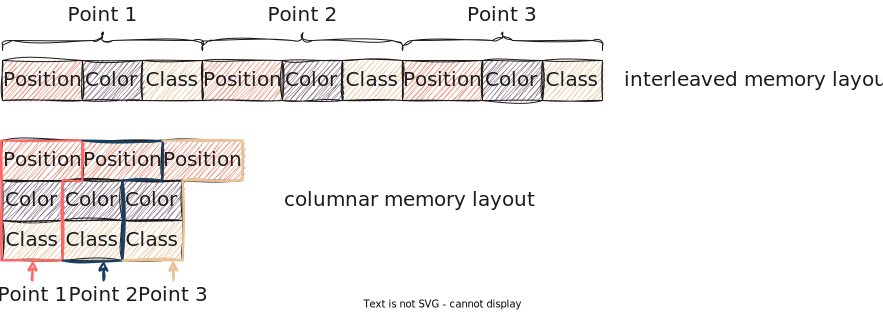

# The built-in point buffer types

`pasture` provides several built-in point buffer types that you can use in your application. These types are:
- [`VectorBuffer`](https://docs.rs/pasture-core/0.4.0/pasture_core/containers/struct.VectorBuffer.html)
- [`HashMapBuffer`](https://docs.rs/pasture-core/0.4.0/pasture_core/containers/struct.HashMapBuffer.html)
- [`ExternalMemoryBuffer`](https://docs.rs/pasture-core/0.4.0/pasture_core/containers/struct.ExternalMemoryBuffer.html)

In this section you will learn about the capabilities of these three buffer types and when to use which. The code examples of this section can be found in the [basic point buffers example](https://github.com/Mortano/pasture/blob/main/pasture-core/examples/basic_point_buffers.rs) in the `pasture` repository.

## `VectorBuffer` - A sensible default

`VectorBuffer` is a point buffer that stores point data in a contiguous memory region using the Rust `Vec` type. We saw this buffer type in some of the previous examples. Just as `Vec` is the go-to data structure for most things in Rust, `VectorBuffer` is a sensible default for working with point cloud data. It closely resembles the type of data management that you might write yourself (think back to `Vec<Point>` in the [data model section](../data_model.md)) if you want something that 'just works'. 

Here is how you can create a `VectorBuffer` for a custom point type:

```rust,editable
/// This point type uses the #[derive(PointType)] macro to auto-generate an appropriate PointLayout
#[repr(C, packed)]
#[derive(Copy, Clone, PointType, Debug, bytemuck::NoUninit, bytemuck::AnyBitPattern)]
struct SimplePoint {
    #[pasture(BUILTIN_POSITION_3D)]
    pub position: Vector3<f64>,
    #[pasture(BUILTIN_INTENSITY)]
    pub intensity: u16,
}

fn main() {
    // Create some points
    let points = vec![
        SimplePoint {
            position: Vector3::new(1.0, 2.0, 3.0),
            intensity: 42,
        },
        SimplePoint {
            position: Vector3::new(-1.0, -2.0, -3.0),
            intensity: 84,
        },
    ];

    // A VectorBuffer can be created from a PointLayout
    let mut buffer = VectorBuffer::new_from_layout(SimplePoint::layout());
    // We can push individual points through a (mutable) PointView:
    buffer.view_mut().push_point(points[0]);
    buffer.view_mut().push_point(points[1]);

    // A more elegant solution is to collect the data from an iterator:
    buffer = points.iter().copied().collect::<VectorBuffer>();
}
```

Recall that a `pasture` point buffer is always a combination of one or more memory regions with a `PointLayout`. The `new_from_layout` function is the way to default-construct most of the point buffer types in `pasture`. It is actually provided through a special trait called [`MakeBufferFromLayout`](https://docs.rs/pasture-core/0.4.0/pasture_core/containers/trait.MakeBufferFromLayout.html). 

```admonish info
Since all point buffers require a `PointLayout`, we can't use the `Default` trait to default-construct point buffers. `PointLayout` does implement `Default`, but the resulting `PointLayout` contains no point attributes. A point buffer with such a layout will never be able to hold any data, as the size of an empty `PointLayout` is zero! For this reason, `pasture` does not implement `Default` for the built-in point buffer types.
```

Since a `VectorBuffer` stores points contiguously in memory, there are a couple of ways to access the point data, which correspond to what you would expect from a `Vec<Point>`:

```rust,editable
// Iterate by value:
for point in buffer.view::<SimplePoint>() {
    println!("{:?}", point);
}

// Iterate by ref:
for point_ref in buffer.view::<SimplePoint>().iter() {
    println!("{:?}", point_ref);
}

// Iterate by mutable ref:
for point_mut in buffer.view_mut::<SimplePoint>().iter_mut() {
    point_mut.intensity *= 2;
}
```

All access to strongly typed point data requires the creation of a [`PointView`](https://docs.rs/pasture-core/0.4.0/pasture_core/containers/struct.PointView.html) structure, which is done by calling [`view::<T>`](https://docs.rs/pasture-core/0.4.0/pasture_core/containers/trait.BorrowedBuffer.html#method.view) on the buffer. For all buffer types, the `PointView` structure always supports accessing point data by value, so in line 2 the type of `point` is `SimplePoint`. The `VectorBuffer` is a buffer with *interleaved memory layout* (which is explained in-depth in the section on [memory layouts](memory_layout.md)). This means that all data for a single point is stored contiguously in memory (just as it would in a `Vec<SimplePoint>`), which allows accessing point data through borrows as shown in line 7. The type of `point_ref` is thus `&SimplePoint`. For mutable access, we have to use a second view type called [`PointViewMut`](https://docs.rs/pasture-core/0.4.0/pasture_core/containers/struct.PointViewMut.html) which is created by calling [`view_mut::<T>`](https://docs.rs/pasture-core/0.4.0/pasture_core/containers/trait.BorrowedMutBuffer.html#method.view_mut) on the buffer. The type of `point_mut` in line 12 is thus `&mut SimplePoint`. 

Note that the point view types also provide methods to access points by index, such as [`at`](https://docs.rs/pasture-core/0.4.0/pasture_core/containers/struct.PointView.html#method.at) and [`set_at`](https://docs.rs/pasture-core/0.4.0/pasture_core/containers/struct.PointViewMut.html#method.set_at). 

```admonish info
The Rust language is limited when it comes to writing types that are generic over mutability, which is why there are two different point view types in `pasture`: One for immutable access and one for mutable access.
```

Besides accessing point data through a `PointView`, we can also access individual attribute values through *attribute views*:

```rust,editable
for position in buffer.view_attribute::<Vector3<f64>>(&POSITION_3D) {
    println!("{position:?}");
}
```

The basic view type for attributes is [`AttributeView`](https://docs.rs/pasture-core/0.4.0/pasture_core/containers/struct.AttributeView.html), which is created by calling [`view_attribute::<T>`](https://docs.rs/pasture-core/0.4.0/pasture_core/containers/trait.BorrowedBuffer.html#method.view_attribute) on a point buffer. The syntax is similar to that for creating point views. The only difference is that we have to tell `pasture` which attribute we want to access, which we do by passing a [`PointAttributeDefinition`](https://docs.rs/pasture-core/0.4.0/pasture_core/layout/struct.PointAttributeDefinition.html) object to `view_attribute::<T>`. The resulting view then provides access to attribute values by value, so the `position` variable in this example is of type `Vector3<f64>` (the type we passed to `view_attribute::<T>`). 

There are also ways to access attribute data by immutable and mutable borrow, analogous to the point views, however the `VectorBuffer` type does not support these. If we want that, we need to use one of the other buffer types, which we will look at now!

## `HashMapBuffer` - A buffer with columnar memory layout

While the `VectorBuffer` is a sensible default, `pasture` supports more fine-grained control over the memory layout of point clouds. One common optimization is to move from an *interleaved memory layout* to a *columnar memory layout* (sometimes called [structure of arrays (SoA)](https://en.wikipedia.org/wiki/AoS_and_SoA)). The following picture illustrates the difference between the two memory layouts:



In a `HashMapBuffer`, all values that belong to the same attribute are stored together in memory using one `Vec<u8>`. So in the image above, all positions are in one vector, all colors in a second vector, and all classifications in a third vector. This is what allows accessing individual attributes by immutable and mutable borrow! First, let's construct a `HashMapBuffer`, which works exactly the same as constructing a `VectorBuffer`:

```rust,editable
let points = vec![
    SimplePoint {
        position: Vector3::new(1.0, 2.0, 3.0),
        intensity: 42,
    },
    SimplePoint {
        position: Vector3::new(-1.0, -2.0, -3.0),
        intensity: 84,
    },
];

let mut buffer = HashMapBuffer::new_from_layout(SimplePoint::layout());
buffer.view_mut().push_point(points[0]);
buffer.view_mut().push_point(points[1]);

buffer = points.into_iter().collect::<HashMapBuffer>();
```

If we want to access the values of a specific point attribute, we have to use attribute views, with the notable difference that the `HashMapBuffer` supports attribute views with immutable and mutable access to individual attributes:

```rust,editable
for intensity in buffer.view_attribute::<u16>(&INTENSITY).iter() {
    println!("{intensity}");
}

for intensity in buffer.view_attribute_mut::<u16>(&INTENSITY).iter_mut() {
    *intensity *= 2;
}
```

In line 1, the type of `intensity` is `&u16`, in line 5 the type of `intensity` is `&mut u16`. The latter allows in-place manipulation of attribute data. 

```admonish tip
We could achieve the same result by using a `VectorBuffer` and accessing the `intensity` field on the `SimplePoint` structure. The advantage of the columnar memory layout is that it is more cache-efficient, as all intensity values are stored together in memory, compared to the interleaved memory layout, where you always have 2 intensity bytes followed by 24 (unused) position bytes that are skipped over.
```

The `HashMapBuffer` is especially useful if you do not have a corresponding `struct` definition for the `PointLayout` of your type. Reading LAS files is a good example for such a situation, as the actual memory layout of the points in the file is only known at runtime, and LAS even supports user-defined attributes. There is no way of creating a matching `struct` for every possible LAS point memory layout, so `pasture` builds a matching `PointLayout` dynamically at runtime. As a consequence, we can't use point views because we don't have a corresponding `PointType` that we can pass to `view::<T>`[^1]. We thus have to access point data through attribute views, which is more efficient with a `HashMapBuffer` than with a `VectorBuffer`. 

```admonish tip
We haven't yet covered [*point layout conversions*](https://docs.rs/pasture-core/0.4.0/pasture_core/layout/conversion/struct.BufferLayoutConverter.html), but these are also more efficient when converting between `HashMapBuffers` due to cache efficiency.  
```

[^1]: There are exceptions of course. The LAS format in version 1.4 defines 11 point formats with well-known memory layouts, for which `pasture` does provide [`struct` definitions](https://docs.rs/pasture-io/latest/pasture_io/las/struct.LasPointFormat0.html). If the memory layout of a file matches one of these memory layouts and does not have user-defined attributes, point views can be used. 

## A glimpse at `ExternalMemoryBuffer`

The last built-in buffer type is experimental and subject to change. It is called [`ExternalMemoryBuffer`](https://docs.rs/pasture-core/0.4.0/pasture_core/containers/struct.ExternalMemoryBuffer.html) and does what the name suggests: It refers to an *external* memory location that the buffer does NOT own itself. It works like `VectorBuffer`, except the underlying memory block is not a `Vec<u8>` but instead a `&[u8]` (or `&mut [u8]`). It allows structuring a piece of external memory as a point buffer with a known `PointLayout`, which is useful in situations where you want to read from or write to a memory region that you obtain from some external source. The two main examples that come to mind here are:
- Using memory mapped I/O, where the memory mapping systems call (e.g. [`mmap`]()) returns a pointer to a memory region, which we want to treat as a point buffer. There is a [`pasture` example](https://github.com/Mortano/pasture/blob/main/pasture-io/examples/fast_las_parsing.rs) for using this to view the contents of a LAS file as a point buffer.
- Doing GPGPU computations, where you have to copy data from/to GPU buffers, which are obtained through special API calls that return a pointer

As this type is experimental, we won't cover it in more detail.