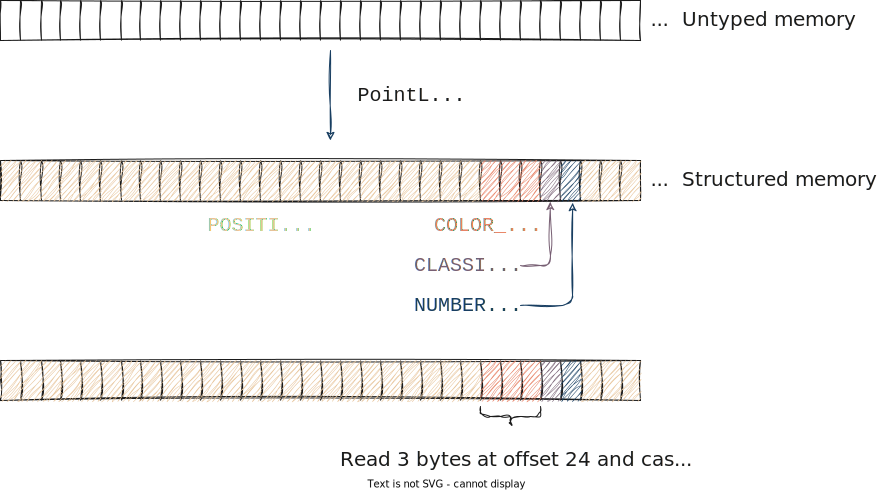

# Understanding the `PointLayout` type

In this section you will learn all about the [`PointLayout`](https://docs.rs/pasture-core/0.4.0/pasture_core/layout/struct.PointLayout.html) type in `pasture`. You will learn how it is used to represent the structure of the points in your point clouds, how it relates to individual point attributes, and how you can create your own `PointLayout` either from hand or from an existing `struct` definition. Additionally you will learn about all the built-in point attribute definitions that `pasture` provides, and how you can create your own point attributes. 

## Point attributes

In the [data model section](data_model.md) of this tutorial we learned that `pasture` models a point cloud as a collection of tuples of attributes. A point attribute is a uniquely identifiable piece of data, which `pasture` represents using two types: [`PointAttributeDefinition`](https://docs.rs/pasture-core/0.4.0/pasture_core/layout/struct.PointAttributeDefinition.html) and [`PointAttributeMember`](https://docs.rs/pasture-core/0.4.0/pasture_core/layout/struct.PointAttributeMember.html). Understanding how attributes combine to form a `PointLayout` will also answer the question why there are two distinct attribute types in `pasture`. 

When we talk about specific point attributes, we often refer to them by their *name*, which is why `pasture` uses strings as the unique identifiers for point attributes. To get a feel for the different types of point attributes that are commonly used, we can look at the [LAS file specification](https://www.asprs.org/wp-content/uploads/2019/07/LAS_1_4_r15.pdf), specifically under the section that defines the *point data record formats*. Looking at point data record format 0---the simplest format that LAS provides---we see the following list of point attributes:

|Item|Format|Size|Required|
|-|-|-|-|
|X|long|4 bytes|yes|
|Y|long|4 bytes|yes|
|Z|long|4 bytes|yes|
|Intensity|unsigned short|2 bytes|no|
|Return Number|3 bits (bits 0-2)|3 bits|yes|
|Number of Returns (Given Pulse)|3 bits (bits 3-5)|3 bits|yes|
|Scan Direction Flag|1 bit (bit 6)|1 bit|yes|
|Edge of Flight Line|1 bit (bit 7)|1 bit|yes|
|Classification|unsigned char|1 byte|yes|
|Scan Angle Rank (-90 to +90) – Left Side|signed char|1 byte|yes|
|User Data|unsigned char|1 byte|no|
|Point Source ID|unsigned short|2 bytes|yes|

We see the name of each attribute (the `Item` column), the data type used to represent the attribute (the `Format`) column, how many bits or bytes a single value of that attribute requires (the `Size` column), and whether or not it is required to include this value in the LAS point record (the `Required` column). We don't really care about the last column, but the first three columns are interesting. Not only do they explain what types of data a single point might contain, they also give information of the *memory representation* of the point data. `pasture` deals with efficient in-memory representations of point clouds, so the mapping of memory ranges to the actual point attributes is a central part of what `pasture` does. It does this by using precisely the information we saw in the table: 

Each point attribute in `pasture` has a unique name, a data type and a size! If you look at the [`PointAttributeDefinition`](https://docs.rs/pasture-core/0.4.0/pasture_core/layout/struct.PointAttributeDefinition.html) type, you will see three corresponding accessors:
- [`fn name(&self) -> &str`](https://docs.rs/pasture-core/0.4.0/pasture_core/layout/struct.PointAttributeDefinition.html#method.name) for accessing the name of the attribute
- [`fn datatype(&self) -> PointAttributeDataType`](https://docs.rs/pasture-core/0.4.0/pasture_core/layout/struct.PointAttributeDefinition.html#method.datatype) for accessing the data type of the attribute
- [`fn size(&self) -> u64`](https://docs.rs/pasture-core/0.4.0/pasture_core/layout/struct.PointAttributeDefinition.html#method.size) for accessing the size in bytes of the attribute

If we look into the [`layout::attributes` module](https://docs.rs/pasture-core/0.4.0/pasture_core/layout/attributes/index.html) we see all the predefined point attributes that `pasture` provides:

|Name|Description|
|-|-|
|CLASSIFICATION|Attribute definition for a classification. Default datatype is U8|
|CLASSIFICATION_FLAGS|Attribute definition for the classification flags. Default datatype is U8|
|COLOR_RGB|Attribute definition for an RGB color. Default datatype is Vec3u16|
|EDGE_OF_FLIGHT_LINE|Attribute definition for an edge of flight line flag. Default datatype is Bool|
|GPS_TIME|Attribute definition for a GPS timestamp. Default datatype is F64|
|INTENSITY|Attribute definition for an intensity value. Default datatype is U16|
|NIR|Attribute definition for near-infrared records (NIR). Default datatype is U16|
|NORMAL|Attribute definition for a 3D point normal. Default datatype is Vec3f32|
|NUMBER_OF_RETURNS|Attribute definition for the number of returns. Default datatype is U8|
|POINT_ID|Attribute definition for a point ID. Default datatype is U64|
|POINT_SOURCE_ID|Attribute definition for a point source ID. Default datatype is U16|
|POSITION_3D|Attribute definition for a 3D position. Default datatype is Vec3f64|
|RETURN_NUMBER|Attribute definition for a return number. Default datatype is U8|
|RETURN_POINT_WAVEFORM_LOCATION|Attribute definition for the return point waveform location in the LAS format. Default datatype is F32|
|SCANNER_CHANNEL|Attribute definition for the scanner channel. Default datatype is U8|
|SCAN_ANGLE|Attribute definition for a scan angle with extended precision (like in LAS format 1.4). Default datatype is I16|
|SCAN_ANGLE_RANK|Attribute definition for a scan angle rank. Default datatype is I8|
|SCAN_DIRECTION_FLAG|Attribute definition for a scan direction flag. Default datatype is Bool|
|USER_DATA|Attribute definition for a user data field. Default datatype is U8|
|WAVEFORM_DATA_OFFSET|Attribute definition for the offset to the waveform data in the LAS format. Default datatype is U64|
|WAVEFORM_PACKET_SIZE|Attribute definition for the size of a waveform data packet in the LAS format. Default datatype is U32|
|WAVEFORM_PARAMETERS|Attribute definition for the waveform parameters in the LAS format. Default datatype is Vector3|
|WAVE_PACKET_DESCRIPTOR_INDEX|Attribute definition for the wave packet descriptor index in the LAS format. Default datatype is U8|

## Point attribute data types

The description of each built-in attribute includes a statement of the form "The default datatype is X". `pasture` makes an assumption what a good default datatype is for each attribute. Here are some examples:
- `POSITION_3D` -> `Vec3f64`
- `CLASSIFICATION` -> `U8`
- `COLOR_RGB` -> `Vec3u16`

These datatypes roughly correspond to primitive types that Rust supports, plus several vector types provided by `nalgebra`. `pasture` defines the [`PointAttributeDataType`](https://docs.rs/pasture-core/0.4.0/pasture_core/layout/enum.PointAttributeDataType.html) enum, which constrains the valid datatypes for point attributes. It includes all integer and floating-point types up to and including 64 bits, some three- and four-component vector types (themselves of integers and floating-point values), as well as two special types `ByteArray(u64)` and `Custom{ ... }`. Each of these datatypes has a well-known binary representation and corresponds to a specific Rust type, which is what allows conversions between untyped memory (`[u8]`) and strongly typed attribute data. This correspondence is established using the [`PrimitiveType`](https://docs.rs/pasture-core/0.4.0/pasture_core/layout/trait.PrimitiveType.html) trait, which is a trait that `pasture` implements for the Rust integer and floating-point primitive types and some of the `nalgebra` vector types. It allows code like this:

```rust
let datatype: PointAttributeDataType = f64::data_type();
```

For memory safety, `pasture` uses the [`bytemuck`](https://docs.rs/bytemuck/latest/bytemuck/) crate, which ensures that all memory transmutations from and to untyped memory are safe. This is done by requiring that all `pasture` primitive types have to implement [`bytemuck::Pod`](https://docs.rs/bytemuck/latest/bytemuck/trait.Pod.html). This has some interesting but also limiting side-effects, in particular it prevents `pasture` from supporting the Rust primitive type `bool`, which is not valid for any bit pattern (i.e. it is represented using 8 bits, but only the bit patterns `0` and `1` are valid). We will shortly see that this also has implications for which types of `struct`s you are allowed to use as point representations. 

## Custom attributes

Besides the built-in attribute definitions, you can easily create your own point attributes using [`PointAttributeDefinition::custom`](https://docs.rs/pasture-core/0.4.0/pasture_core/layout/struct.PointAttributeDefinition.html#method.custom):

```rust
let custom_attribute = PointAttributeDefinition::custom(Cow::Borrowed("Custom"), PointAttributeDataType::F32);
```

It is a `const fn`, so you can create compile-time constant point attributes, which is precisely what all the built-in attribute definitions are! `pasture-io` uses the same mechanism to add LAS-specific attribute definitions, for example the [`ATTRIBUTE_LOCAL_LAS_POSITION`](https://docs.rs/pasture-io/0.4.0/pasture_io/las/constant.ATTRIBUTE_LOCAL_LAS_POSITION.html) which corresponds to a point position in the local space of a LAS file, represented using 32-bit signed integers:

```rust
pub const ATTRIBUTE_LOCAL_LAS_POSITION: PointAttributeDefinition = PointAttributeDefinition::custom(
    Cow::Borrowed("LASLocalPosition"),
    PointAttributeDataType::Vec3i32,
);
```

## From attributes to `PointLayout`

So far we saw how `pasture` represents a single point attribute. Now we will look at combining multiple point attributes into the full description of a point cloud, i.e. the [`PointLayout`](https://docs.rs/pasture-core/0.4.0/pasture_core/layout/struct.PointLayout.html) type! This will also answer the question why there are two types for point attributes in `pasture`!

Recall the custom `Point` type that we wrote in the [Data Model section](data_model.md):

```rust, editable
use nalgebra::Vector3;

type Position = Vector3<f64>;
type Classification = u8;
type Color = Vector3<u8>;
type NumberOfReturnPulses = u8;

type Point = (Position, Color, Classification, NumberOfReturnPulses);
```

Let's restate it using `struct` syntax instead of tuple syntax:

```rust,editable
struct Point {
    pub position: Position, //Vector3<f64>
    pub color: Color, //Vector3<u8>
    pub classification: Classification, //u8
    pub number_of_returns: NumberOfReturnPulses, //u8
}
```

To describe this point type in `pasture`, we first need one `PointAttributeDefinition` for each of the members:

```rust,editable
use pasture_core::layout::attributes::*;

let position_attribute = POSITION_3D;
let color_attribute = COLOR_RGB.with_custom_datatype(PointAttributeDataType::Vec3u8);
let classification_attribute = CLASSIFICATION;
let number_of_returns_attribute = NUMBER_OF_RETURNS;
```

We can use the built-in attribute definitions for every attribute, which is convenient. The only change is that `pasture` assumes RGB colors to be represented using the `Vec3u16` datatype (a convention taken from the LAS file format), but here we want 8-bit unsigned integers instead, so we modify the datatype to be `Vec3u8` instead. Note that this does not affect the global `COLOR_RGB` constant but instead creates a new `PointAttributeDefinition` instance. 

In order to combine these attributes into a `PointLayout`, we have to understand what the purpose of the `PointLayout` structure is: The `PointLayout` provides the information necessary to go from untyped memory to strongly typed attribute and point values! This means that it has to include all the information about the exact memory layout of each attribute as well as their relationship to each other, for example the order of the attributes within a point record. So if you write the following code, `pasture` needs to know how to execute it and whether it is correct or would violate memory safety:

```rust,editable
let buffer: VectorBuffer = ...; // A buffer that stores `Point` values, obtained from somewhere
// Get the color of the first point:
let color = buffer.view_attribute::<Vector3<u8>>(&color_attribute).at(0);
```

Since `VectorBuffer` stores untyped memory internally (`Vec<u8>`), here is what `pasture` has to do:



The call `.at(0)` in the code example above translates to the instruction "Read 3 bytes at offset 24 and cast to `Vector3<u8>`" in the figure. It contains three pieces of information that are only known at runtime and which are included in the `PointLayout` type{{#sn The necessary information is actually calculated not only from the `PointLayout`, but also based on the memory layout of the point buffer, since offsets are calculated differently in interleaved memory layout vs. columnar memory layout. We will learn all about that in the section on [buffer memory layouts](point_buffers/memory_layout.md).}}: 
- The *read offset* (24 bytes)
- The *read size* (3 bytes)
- The static type that the memory should be interpreted{{#sn Interpreted is the correct term here, because that is what all statically typed programming languages do: Static types provide the semantics for raw memory and hence define how memory regions are interpreted, from which follow the correct assembly instructions for reading from or writing to memory. If we write `let m = variable.member;`, it is the job of the compiler to figure out the correct instructions for reading the memory corresponding to `member` from the instance `variable` based on the static type of `variable`. The compiler does this at compile time, `pasture` does something similar at runtime!}} as (`Vector3<u8>`)

Two of the three properties are already included in the `PointAttributeDefinition` type: The read size is simply the size of the attribute datatype, and the static type is given by the user (`Vector3<u8>`) and has to correspond to the attribute datatype. `pasture` performs a runtime check in `view_attribute` to make sure that these two types match! The offset however is not known given only a `PointAttributeDefinition`. It depends on the *order of attributes* within the point type. Take a look at the following two point type definitions and try to figure out in which sense they are identical and in which sense they differ:

```rust,editable
struct Point1 {
    pub position: Position, //Vector3<f64>
    pub color: Color, //Vector3<u8>
    pub classification: Classification, //u8
    pub number_of_returns: NumberOfReturnPulses, //u8
}

struct Point2 {
    pub classification: Classification, //u8
    pub color: Color, //Vector3<u8>
    pub number_of_returns: NumberOfReturnPulses, //u8
    pub position: Position, //Vector3<f64>
}
```

Both types have the exact same point attributes but in a different order. Even for attributes at the same index, such as the `color` attribute, their memory locations can differ. The actual offset is determined by the Rust compiler when calculating the [*representation*](https://doc.rust-lang.org/reference/type-layout.html#representations) of the type. The default algorithm is implementation-defined, but assuming a simple algorithm the offset of `Point1::color` might be 24 bytes (the size of the `position` field), whereas the offset of `Point2::color` might be 1 byte (the size of the `classification` field). 

If you want to know all the details about point type memory layout and how to manually build a `PointLayout`, read on! If you only care about something that works, skip to ["Using the `#[derive(PointType)]` macro"](#using-the-derivepointtype-macro).

## Details of point memory layouts

Getting the memory layout of a point type right is one of the more challenging aspects that `pasture` has to deal with. It matters most when going from untyped memory to user-defined point types, such as the `Point1` and `Point2` types from the previous example. Note that if you only ever access point data through the attribute views and never use the point views (which require a strongly typed point type such as `Point1`), most of these details will not concern you!

We will now build a `PointLayout` from scratch for the `Point2` type and learn all about type representations and alignment requirements, as well as some details regarding memory transmutations. Time to have some fun!

To make things a bit easier, we will use `f32` positions instead of `f64` so that the overall type has less bytes. This makes some of the figures easier to follow. Here is the updated `Point2` type:

```rust,editable
struct Point2 {
    pub classification: Classification, //u8
    pub color: Color, //Vector3<u8>
    pub number_of_returns: NumberOfReturnPulses, //u8
    pub position: Position, //Vector3<f32> !!
}
```

First we have to figure out the size of each attribute, which we can then sum to get the total size of a single `Point2` instance in memory:
- `classification` -> `u8` -> 1 byte
- `color` -> `Vector3<u8>` -> semantically equivalent to `[u8; 3]` -> 3 bytes
- `number_of_returns` -> `u8` -> 1 byte
- `position` -> `Vector3<f32>` -> semantically equivalent to `[f32; 3]` -> 4*3 = 12 bytes

If we sum everything together, we get 17 bytes. Let's see what `println!("{}", std::mem::size_of::<Point2>())` returns:

```
fn main() { 
    println!("{}", std::mem::size_of::<Point2>());    
}

// Output: 20
```

The difference (which might vary depending on the compiler version and target platform) is due to the [Rust rules for type representations](https://doc.rust-lang.org/reference/type-layout.html#representations). Unfortunately, not only is the default type representation (the `Rust` representation) implementation-defined, there is not even a stabilized API for querying the offset of a variable within a type{{#sn There is [`std::mem::offset_of!`](https://doc.rust-lang.org/std/mem/macro.offset_of.html), but it is nightly-only at the moment, and it is somewhat limited.}}! For this reason, `pasture` does not support creating a `PointLayout` for a `struct` that uses the default `Rust` representation! Instead, all types that want to implement the [`PointType`](https://docs.rs/pasture-core/0.4.0/pasture_core/layout/trait.PointType.html) trait---a trait required for the type to work with the point view function [`view::<T>`](https://docs.rs/pasture-core/0.4.0/pasture_core/containers/trait.BorrowedBuffer.html#method.view)---should use the `C` representation instead.

```admonish warning
`pasture` does not enforce implementors of the `PointType` trait to use the `C` representation as the Rust language does not support such constraints. Correctly implementing the `PointLayout` for a type using the `Rust` representation will be impractical and is strongly discouraged. Even if you manage to do so, types with the `Rust` representation may contain padding bytes, which breaks the guarantees made by `bytemuck::NoUninit`! 
```

The `C` representation has a predictable algorithm for calculating the offsets of members within a `struct` (explained in detail [here](https://doc.rust-lang.org/reference/type-layout.html#reprc-structs)) which we can use to figure out the correct offsets to all our point attributes. Unfortunately even with the `C` representation, the compiler is allowed to insert *padding bytes* which would break the requirements that `pasture` has which enable memory transmutations. To get rid of padding bytes, we have to use `#[repr(packed)]`, which removes any padding bytes. So we have to change our definition of the `Point2` type:

```rust,editable
#[repr(C, packed)]
struct Point2 {
    pub classification: Classification, //u8
    pub color: Color, //Vector3<u8>
    pub number_of_returns: NumberOfReturnPulses, //u8
    pub position: Position, //Vector3<f32>
}
```

Now `std::mem::size_of::<Point2>()` returns 17, as would be expected. The offset for each member can now be easily calculated as the size of all preceding members. Luckily, we don't have to do this by hand: The `PointLayout` type has a [`add_attribute`](https://docs.rs/pasture-core/0.4.0/pasture_core/layout/struct.PointLayout.html#method.add_attribute) function! So building a `PointLayout` for `Point2` works like this:

```rust,editable
use pasture_core::layout::*;
use pasture_core::layout::attributes::*;

let mut layout = PointLayout::default();
layout.add_attribute(CLASSIFICATION, FieldAlignment::Packed(1));
layout.add_attribute(
    COLOR_RGB.with_custom_datatype(PointAttributeDataType::Vec3u8), 
    FieldAlignment::Packed(1));
layout.add_attribute(NUMBER_OF_RETURNS, FieldAlignment::Packed(1));
layout.add_attribute(
    POSITION_3D.with_custom_datatype(PointAttributeDataType::Vec3f32), 
    FieldAlignment::Packed(1));
```

We use `FieldAlignment::Packed(1)` to prevent any padding bytes from being added{{#sn Why does `pasture` support padding bytes in a `PointLayout` when manually adding attributes, if it is not supported to have a `PointType` that includes padding bytes? Because you are allowed to access individual attributes even if there is padding, since padding only affects the point view type (obtained by calling [`view::<T>`](https://docs.rs/pasture-core/0.4.0/pasture_core/containers/trait.BorrowedBuffer.html#method.view) on the point buffer) but not the attribute views (obtained by calling [`view_attribute::<T>`](https://docs.rs/pasture-core/0.4.0/pasture_core/containers/trait.BorrowedBuffer.html#method.view_attribute) on the buffer).}} and end up with a `PointLayout` that correctly represents the memory representation of the `Point2` type. The calculated offset of each point attribute is stored within the `PointLayout` together with the `PointAttributeDefinition` using the second attribute type: [`PointAttributeMember`](https://docs.rs/pasture-core/0.4.0/pasture_core/layout/struct.PointAttributeMember.html). A `PointAttributeMember` is therefore a specific instance of a point attribute within the memory layout of a point type. This distinction allows using the `PointAttributeDefinition` as a general identifier for attributes independent of any actual point type. Take a look at the two original point types `Point1` and `Point2` again:

```rust,editable
struct Point1 {
    pub position: Position, //Vector3<f64>
    pub color: Color, //Vector3<u8>
    pub classification: Classification, //u8
    pub number_of_returns: NumberOfReturnPulses, //u8
}

struct Point2 {
    pub classification: Classification, //u8
    pub color: Color, //Vector3<u8>
    pub number_of_returns: NumberOfReturnPulses, //u8
    pub position: Position, //Vector3<f64>
}
```

Both types contain the same attributes but with different offsets. If we ask the question "Does type `X` have the point attribute `CLASSIFICATION`?", then we want the answer to be affirmative for both `Point1` and `Point2`. `PointAttributeDefinition` is the type for checking such a property. If we instead ask "At which byte offset lies the `CLASSIFICATION` attribute in type `X`?", we need the information encoded in the `PointAttributeMember`. You will rarely interact with this type directly, most of it is done by `pasture` internally.

## Using the `#[derive(PointType)]` macro

You don't have to create the correct `PointLayout` for your desired point type by hand. `pasture` supports a `#[derive(PointType)]` macro which auto-generates the correct `PointLayout` based on the memory layout of your `struct`. Let's look at [an example](https://github.com/Mortano/pasture/blob/main/pasture-core/examples/custom_point_type.rs):

```rust,editable
#[derive(PointType, Clone, Copy, bytemuck::NoUninit, bytemuck::AnyBitPattern)]
#[repr(C, packed)]
struct CustomPointType {
    #[pasture(BUILTIN_INTENSITY)]
    pub intensity: u16,
    #[pasture(BUILTIN_POSITION_3D)]
    pub position: Vector3<f32>,
    #[pasture(attribute = "CUSTOM_ATTRIBUTE")]
    pub custom_attribute: f32,
}
```

The `CustomPointType` structure has three point attributes, each corresponding to one of the fields. To tell `pasture` which field represents which attribute, we have to annotate the fields with `#[pasture(X)]`, where `X` is either the name of a built-in attribute, or the special syntax `attribute = "name"` for custom attributes. The example shows both usage patterns. Built-in attribute names follow the structure `BUILTIN_X`, where `X` is the name of the corresponding attribute definition constant as found in the [`layout::attributes` module](https://docs.rs/pasture-core/0.4.0/pasture_core/layout/attributes/index.html). 

Then we have to derive a lot of stuff. First, we derive `PointType`, which will implement the [`PointType`](https://docs.rs/pasture-core/0.4.0/pasture_core/layout/trait.PointType.html) trait for us. This trait has a method `fn layout() -> PointLayout` that returns the `PointLayout` for the type it is implemented on. In order to use the derive macro, our `struct` must adhere to the `pasture` requirements as described in the previous section:
- It must use the `C` representation (`#[repr(C)]`)
- It must not include any padding bytes (`#[repr(packed)]`)
- It must implement `bytemuck::NoUninit` and `bytemuck::AnyBitPattern`, which have derive macros of their own
    - This in turn requires that the type implements `Copy`
    - `bytemuck::NoUninit` disallows padding bytes
    - `bytemuck::AnyBitPattern` disallows `bool`, `enum`s and any types that are not valid for all possible bit patterns
- The data type of each field must be one of the supported [primitive types](https://docs.rs/pasture-core/0.4.0/pasture_core/layout/trait.PrimitiveType.html)

These restrictions are quite severe but are necessary to allow safe memory transmutations in `pasture`. The resulting `PointLayout` looks like this:

```
PointLayout {
    [Intensity;U16 @ offset 0]
    [Position3D;Vec3<f32> @ offset 2]
    [CUSTOM_ATTRIBUTE;F32 @ offset 14]
}
```